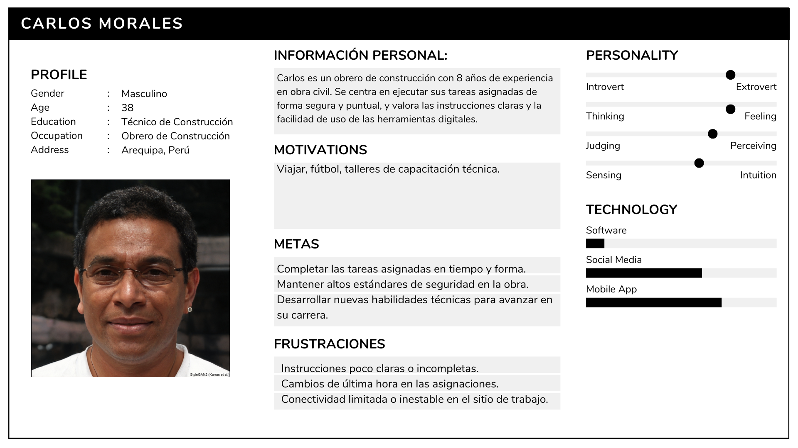
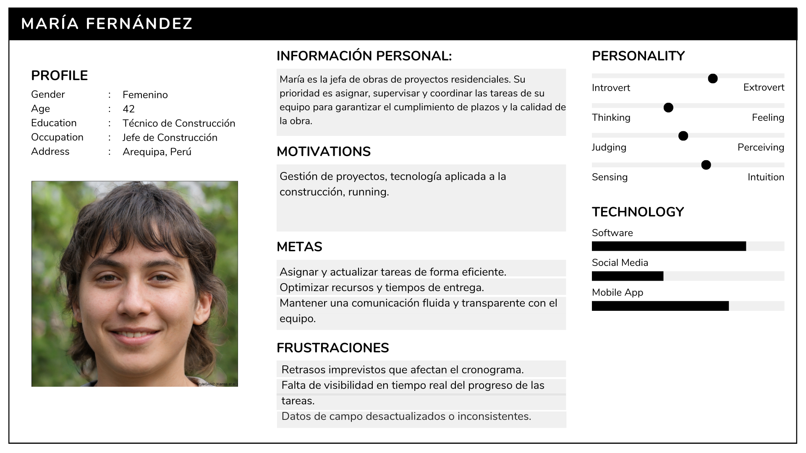
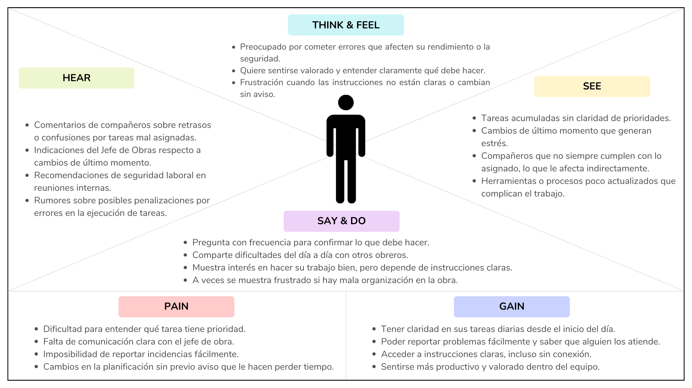

<h3 align="center"> Universidad Peruana de Ciencias Aplicadas </h3>

<h3 align="center"> Ingeniería de Software </h3>
<h3 align="center"> Ciclo 2024 - 2 </h3>

 

<!--Logo UPC-->

    </img>

 
<h3 align="center"> Desarrollo de Aplicaiones Open Source - SW56 </h3>
<h3 align="center"> Profesor del Curso:  </h3>
<h3 align="center"> "INFORME DE TRABAJO FINAL"</h3>
<h3 align="center"> EMPRESA DE INICIO: nombre </h3>

<h3 align="center"> PRODUCTO: "NOMBRE"</h3>

| Miembro                                |    Código     |
| :------------------------------------- | :-----------: |
| Pachas Chavez, Alejandro Alberto     | U201917598    |
| Rengifo Lozano, David   | U202221022   |
| Chavez Viera Joseph Manuel          | U202314019    |
| Estrada Cajamune Abraham Andres    |  U202112164   |
|               |      |
|           |      |

<h3 align="center"> 2024 </h3>

 

# **Registro de Versiones del Informe**

<table BORDER>
    <tr>
        <td>VERSION</td>
        <td>FECHA</td>
        <td> AUTOR </td>
        <td>DESCRIPCION DE MODIFICACION</td>
    </tr>
    <tr>
        <td>01</td>
        <td>23/08/2024</td>
        <td> L </td>
        <td>Formato del documento</td>
    </tr>
    <tr>
        <td></td>
        <td></td>
        <td></td>
        <td></td>
    </tr>
    <tr>
        <td></td>
        <td></td>
        <td></td>
        <td></td>
    </tr>
</table>

# **Project Report Collaboration Insights**

URL del repositorio de la Organizacion: <https://github.com/AgroRoute>

# **Contenido**
### Tabla de contenidos
- [**Registro de Versiones del Informe**](#registro-de-versiones-del-informe)
- [**Project Report Collaboration Insights**](#project-report-collaboration-insights)
- [**Contenido**](#contenido)
    - [Tabla de contenidos](#tabla-de-contenidos)
- [**Student Outcome**](#student-outcome)
- [ **Capítulo I: Introducción** ](#-capítulo-i-introducción-)
  - [**1.1. Startup Profile**](#11-startup-profile)
    - [**1.1.1. Descripción de la Startup**](#111-descripción-de-la-startup)
    - [**1.1.2. Perfiles de integrantes del equipo**](#112-perfiles-de-integrantes-del-equipo)
  - [**1.2. Solution Profile**](#12-solution-profile)
    - [**1.2.1 Antecedentes y problemática**](#121-antecedentes-y-problemática)
    - [What (¿Qué?)](#what-qué)
    - [Who (¿Quién?)](#who-quién)
    - [Where (¿Dónde?)](#where-dónde)
    - [When (¿Cuándo?)](#when-cuándo)
    - [Why (¿Por qué?)](#why-por-qué)
    - [How (¿Cómo?)](#how-cómo)
    - [How much (¿Cuánto?)](#how-much-cuánto)
    - [**1.2.2 Lean UX Process**](#122-lean-ux-process)
    - [**1.2.2.1. Lean UX Problem Statements**](#1221-lean-ux-problem-statements)
    - [**1.2.2.2. Lean UX Assumptions**](#1222-lean-ux-assumptions)
    - [**1.2.2.3. Lean UX Hypothesis Statements**](#1223-lean-ux-hypothesis-statements)
    - [**1.2.2.4. Lean UX Canvas**](#1224-lean-ux-canvas)
  - [**1.3. Segmentos objetivo**](#13-segmentos-objetivo)
- [ **Capítulo II: Requirements Elicitation \& Analysis**](#-capítulo-ii-requirements-elicitation--analysis)
  - [**2.1. Competidores**](#21-competidores)
    - [**2.1.1. Análisis competitivo**](#211-análisis-competitivo)
    - [**2.1.2. Estrategias y tácticas frente a competidores**](#212-estrategias-y-tácticas-frente-a-competidores)
  - [**2.2. Entrevistas**](#22-entrevistas)
    - [**2.2.1. Diseño de entrevistas**](#221-diseño-de-entrevistas)
    - [**2.2.2. Registro de entrevistas**](#222-registro-de-entrevistas)
    - [**2.2.3. Análisis de entrevistas**](#223-análisis-de-entrevistas)
  - [**2.3. Needfinding**](#23-needfinding)
    - [**2.3.1. User Personas**](#231-user-personas)
    - [**2.3.2. User Task Matrix**](#232-user-task-matrix)
    - [**2.3.3. User Journey Mapping**](#233-user-journey-mapping)
    - [**2.3.4. Empathy Mapping**](#234-empathy-mapping)
    - [**2.3.5. As-is Scenario Mapping**](#235-as-is-scenario-mapping)
  - [**2.4. Ubiquitous Language**](#24-ubiquitous-language)
- [ **Capítulo III: Requirements Specification**](#-capítulo-iii-requirements-specification)
  - [**3.1. To-Be Scenario Mapping**](#31-to-be-scenario-mapping)
  - [**3.2. User Stories**](#32-user-stories)
  - [**3.3. Impact Mapping**](#33-impact-mapping)
  - [**3.4. Product Backlog**](#34-product-backlog)
- [**Capítulo IV: Product Design**](#capítulo-iv-product-design)
  - [**4.1. Style Guidelines**](#41-style-guidelines)
    - [**4.1.1. General Style Guidelines**](#411-general-style-guidelines)
    - [**4.1.2. Web Style Guidelines**](#412-web-style-guidelines)
  - [**4.2. Information Architecture**](#42-information-architecture)
    - [**4.2.1. Organization Systems**](#421-organization-systems)
    - [**4.2.2. Labeling Systems**](#422-labeling-systems)
    - [**4.2.3. SEO Tags and Meta Tags**](#423-seo-tags-and-meta-tags)
    - [**4.2.4. Searching Systems**](#424-searching-systems)
    - [**4.2.5. Navigation Systems**](#425-navigation-systems)
  - [**4.3. Landing Page UI Design**](#43-landing-page-ui-design)
    - [**4.3.1. Landing Page Wireframe**](#431-landing-page-wireframe)
    - [**4.3.2. Landing Page Mock-up**](#432-landing-page-mock-up)
  - [**4.4. Web Applications UX/UI Design**](#44-web-applications-uxui-design)
    - [**4.4.1. Web Applications Wireframes**](#441-web-applications-wireframes)
    - [**4.4.2. Web Applications Wireflow Diagrams**](#442-web-applications-wireflow-diagrams)
    - [**4.4.3. Web Applications Mock-ups**](#443-web-applications-mock-ups)
    - [**4.4.4. Web Applications User Flow Diagrams**](#444-web-applications-user-flow-diagrams)
  - [**4.5. Web Applications Prototyping**](#45-web-applications-prototyping)
  - [**4.6. Domain-Driven Software Architecture**](#46-domain-driven-software-architecture)
    - [**4.6.1. Software Architecture Context Diagram**](#461-software-architecture-context-diagram)
    - [**4.6.2. Software Architecture Container Diagrams**](#462-software-architecture-container-diagrams)
    - [**4.6.3. Software Architecture Components Diagrams**](#463-software-architecture-components-diagrams)
  - [**4.7. Software Object-Oriented Design**](#47-software-object-oriented-design)
    - [**4.7.1. Class Diagrams**](#471-class-diagrams)
    - [**4.7.2. Class Dictionary**](#472-class-dictionary)
  - [**4.8. Database Design**](#48-database-design)
    - [**4.8.1. Database Diagram**](#481-database-diagram)
- [**Capítulo V: Product Implementation, Validation \& Deployment**](#capítulo-v-product-implementation-validation--deployment)
  - [**5.1. Software Configuration Management**](#51-software-configuration-management)
    - [**5.1.1. Software Development Environment Configuration**](#511-software-development-environment-configuration)
    - [**5.1.2. Source Code Management**](#512-source-code-management)
    - [**5.1.3. Source Code Style Guide \& Conventions**](#513-source-code-style-guide--conventions)
    - [**5.1.4. Software Deployment Configuration**](#514-software-deployment-configuration)
  - [**5.2. Landing Page, Services \& Applications Implementation**](#52-landing-page-services--applications-implementation)
    - [**5.2.1. Sprint 1**](#521-sprint-1)
        - [**5.2.1.1. Sprint Planning 1**](#5211-sprint-planning-1)
        - [**5.2.1.2. Sprint Backlog 1**](#5212-sprint-backlog-1)
        - [**5.2.1.3. Development Evidence for Sprint Review**](#5213-development-evidence-for-sprint-review)
        - [**5.2.1.4. Testing Suite Evidence for Sprint Review**](#5214-testing-suite-evidence-for-sprint-review)
        - [**5.2.1.5. Execution Evidence for Sprint Review**](#5215-execution-evidence-for-sprint-review)
        - [**5.2.1.6. Services Documentation Evidence for Sprint Review**](#5216-services-documentation-evidence-for-sprint-review)
        - [**5.2.1.7. Software Deployment Evidence for Sprint Review**](#5217-software-deployment-evidence-for-sprint-review)
        - [**5.2.1.8. Team Collaboration Insights during Sprint**](#5218-team-collaboration-insights-during-sprint)
    - [**5.2.2. Sprint 2**](#522-sprint-2)
        - [**5.2.2.1. Sprint Planning 2**](#5221-sprint-planning-2)
        - [**5.2.2.2. Sprint Backlog 2**](#5222-sprint-backlog-2)
        - [**5.2.2.3. Development Evidence for Sprint Review**](#5223-development-evidence-for-sprint-review)
        - [**5.2.2.4. Testing Suite Evidence for Sprint Review**](#5224-testing-suite-evidence-for-sprint-review)
        - [**5.2.2.5. Execution Evidence for Sprint Review**](#5225-execution-evidence-for-sprint-review)
        - [**5.2.2.6. Services Documentation Evidence for Sprint Review**](#5226-services-documentation-evidence-for-sprint-review)
        - [**5.2.2.7. Software Deployment Evidence for Sprint Review**](#5227-software-deployment-evidence-for-sprint-review)
        - [**5.2.2.8. Team Collaboration Insights during Sprint**](#5228-team-collaboration-insights-during-sprint)
    - [**5.2.3. Sprint 3**](#523-sprint-3)
        - [**5.2.3.1. Sprint Planning 3**](#5231-sprint-planning-3)
        - [**5.2.3.2. Sprint Backlog 3**](#5232-sprint-backlog-3)
        - [**5.2.3.3. Development Evidence for Sprint Review**](#5233-development-evidence-for-sprint-review)
        - [**5.2.3.4. Testing Suite Evidence for Sprint Review**](#5234-testing-suite-evidence-for-sprint-review)
        - [**5.2.3.5. Execution Evidence for Sprint Review**](#5235-execution-evidence-for-sprint-review)
        - [**5.2.3.6. Services Documentation Evidence for Sprint Review**](#5236-services-documentation-evidence-for-sprint-review)
        - [**5.2.3.7. Software Deployment Evidence for Sprint Review**](#5237-software-deployment-evidence-for-sprint-review)
        - [**5.2.3.8. Team Collaboration Insights during Sprint**](#5238-team-collaboration-insights-during-sprint)
    - [**5.2.4. Sprint 4**](#524-sprint-4)
        - [**5.2.4.1. Sprint Planning 4**](#5241-sprint-planning-4)
        - [**5.2.4.2. Sprint Backlog 4**](#5242-sprint-backlog-4)
        - [**5.2.4.3. Development Evidence for Sprint Review**](#5243-development-evidence-for-sprint-review)
        - [**5.2.4.4. Testing Suite Evidence for Sprint Review**](#5244-testing-suite-evidence-for-sprint-review)
        - [**5.2.4.5. Execution Evidence for Sprint Review**](#5245-execution-evidence-for-sprint-review)
        - [**5.2.4.6. Services Documentation Evidence for Sprint Review**](#5246-services-documentation-evidence-for-sprint-review)
        - [**5.2.4.7. Software Deployment Evidence for Sprint Review**](#5247-software-deployment-evidence-for-sprint-review)
        - [**5.2.4.8. Team Collaboration Insights during Sprint**](#5248-team-collaboration-insights-during-sprint)
  - [**5.3. Validation Interviews**](#53-validation-interviews)
    - [**5.3.1. Diseño de Entrevistas**](#531-diseño-de-entrevistas)
    - [**5.3.2. Registro de Entrevistas**](#532-registro-de-entrevistas)
    - [**5.3.3. Evaluaciones según heurísticas**](#533-evaluaciones-según-heurísticas)
  - [**5.4. Video About-the-Product**](#54-video-about-the-product)
- [**Conclusiones**](#conclusiones)
- [**Conclusiones y recomendaciones**](#conclusiones-y-recomendaciones)
- [**Video About-the-Team**](#video-about-the-team)
- [**Bibliografía**](#bibliografía)
- [**Anexos**](#anexos)

# **Student Outcome**

#  **Capítulo I: Introducción** 
## **1.1. Startup Profile**
### **1.1.1. Descripción de la Startup**

### **1.1.2. Perfiles de integrantes del equipo**
## **1.2. Solution Profile**

### **1.2.1 Antecedentes y problemática**
### What (¿Qué?)
 

### Who (¿Quién?)
 
### Where (¿Dónde?)
 

### When (¿Cuándo?)
 

### Why (¿Por qué?)
 
### How (¿Cómo?)
 
### How much (¿Cuánto?)
 
### **1.2.2 Lean UX Process**
### 1.2.2.1. Lean UX Problem Statements

#### Problem Statement para Padres:

 
#### Problem Statement para Cuidadores:

 

### 1.2.2.2. Lean UX Assumptions

- **Asumimos que**  
  - **Sabremos que esto es cierto cuando**  

- **Asumimos que** 
  - **Sabremos que esto es cierto cuando** 

- **Asumimos que** 
  - **Sabremos que esto es cierto cuando** 

- **Asumimos que**  
  - **Sabremos que esto es cierto cuando**  

### **1.2.2.3. Lean UX Hypothesis Statements**

<ol>
<li> <b>Creemos que</b>   <b>Sabremos que</b>   <b>cuando</b> 
</li>
<li> <b>Creemos que</b>   <b>Sabremos que</b>    <b>cuando</b>   
</li>
<li> <b>Creemos que</b>  <b>Sabremos que</b>  <b>cuando</b>   
</ol>

### **1.2.2.4. Lean UX Canvas**

##### 1.2.2.1. Lean UX Canvas
<table>
  <tr>
    <th valign="top">
      
<b>1. Business Problem</b>

      
 .

    </th>
    <th valign="top">
      
<b>2. Business Outcomes</b>

      
-   .

      
-  .

      
-  .

      
-  .

    </th>
    <th rowspan="2" valign="top">
      
<b>5. Solutions</b>

      
- .

      
-  .

    </th>
  </tr>
  <tr>
    <td valign="top">
      
<b>3. Users</b>

      
-  .

      
-  .

      
-  .

    </td>
    <td valign="top">
      
<b>4. User Benefits</b>

      
-  .

      
-  

    </td>
  </tr>
  <tr>
    <td valign="top">
      
<b>6. Hypothesis</b>

      
- .

      
-  

    </td>
    <td valign="top">
      
<b>7. What’s the most important thing we need to learn first?</b>

      
 .

    </td>
    <td valign="top">
      
<b>8. What’s the least amount of work we need to do to learn the next most important thing?</b>

      
.

    </td>
  </tr>
</table>

## **1.3. Segmentos objetivo**

 

**1.**

 

- #### Caracteristicas Demograficas
 

**2. **

 

- #### Caracteristicas Demograficas
 
#  **Capítulo II: Requirements Elicitation & Analysis**
## **2.1. Competidores**
### **2.1.1. Análisis competitivo**

<TABLE BORDER style="width:100%">
    <tr>
        <th colspan="6"> Competitive Analysis Landscape</th>
    </tr>
    <tr>
        <td rowspan="2">
            ¿Por qué llevar a cabo este análisis?
        </td>
        <td colspan="5"> 
        Escriba en el recuadro la pregunta que busca responder o el objetivo de este análisis. 
        </td>
    </tr>
    <tr>
        <td colspan="5"></td>
    </tr>
    <tr>
        <td colspan="2">
            (En la cabecera colocar por cada competidor nombre y logo)
        </td>
        <td>Su Startup</td>
        <td>Competidor 1</td>
        <td>Competidor 2</td>
        <td>Competidor 3</td>
    </tr>
    <tr>
        <th rowspan="2"> Perfil</th>
        <td>Overview</td>
        <td></td>
        <td></td>
        <td></td>
        <td></td>
    </tr>
    <tr>
        <td>
            Ventaja competitiva ¿Qué valor ofrece a los clientes?
        </td>
        <td></td>
        <td></td>
        <td></td>
        <td></td>
    </tr>
    <tr>
        <th rowspan="2"> Perfil de Marketing</th>
        <td>Mercado objetivo</td>
        <td></td>
        <td></td>
        <td></td>
        <td></td>
    </tr>
    <tr>
        <td>
            Estrategias de marketing
        </td>
        <td></td>
        <td></td>
        <td></td>
        <td></td>
    </tr>
    <tr>
        <th rowspan="3"> Perfil de Producto</th>
        <td>Productos & Servicios</td>
        <td></td>
        <td></td>
        <td></td>
        <td></td>
    </tr>
    <tr>
        <td>
            Precios & Costos
        </td>
        <td></td>
        <td></td>
        <td></td>
        <td></td>
    </tr>
    <tr>
        <td>
            Canales de distribución (Web y/o Móvil)
        </td>
        <td></td>
        <td></td>
        <td></td>
        <td></td>
    </tr>
    <tr>
        <th rowspan="5"> Análisis SWOT</th>
        <td colspan="5">
        Realice esto para su startup y sus competidores. Sus fortalezas deberían apoyar sus oportunidades y contribuir a lo que ustedes definen como su posible ventaja competitiva. 
        </td>
    </tr>
    <tr>
        <td>
            Fortalezas
        </td>
        <td></td>
        <td></td>
        <td></td>
        <td></td>
    </tr>
    <tr>
        <td>
            Debilidades
        </td>
        <td></td>
        <td></td>
        <td></td>
        <td></td>
    </tr>
    <tr>
        <td>
           Oportunidades
        </td>
        <td></td>
        <td></td>
        <td></td>
        <td></td>
    </tr>
    <tr>
        <td>
            Amenazas
        </td>
        <td></td>
        <td></td>
        <td></td>
        <td></td>
    </tr>
</TABLE>

### **2.1.2. Estrategias y tácticas frente a competidores**

## **2.2. Entrevistas**
### **2.2.1. Diseño de entrevistas**
### **2.2.2. Registro de entrevistas**
### **2.2.3. Análisis de entrevistas**

## **2.3. Needfinding**
### **2.3.1. User Personas**
**Segmento 1:** Obrero de Constructura.  

**Segmento 2:** Jefe de Obras de Constructura.

### **2.3.2. User Task Matrix**

# User Task Matrix

## Usuario: Carlos Morales (Obrero)

| Tareas                                    | Objetivos de las tareas                                          | Soporte de BuildPlanning                                                                                         |
| :----------------------------------------: | :---------------------------------------------------------------: | :---------------------------------------------------------------------------------------------------------------- |
| Ver lista de tareas asignadas             | Conocer qué debe hacer cada día y en qué orden                   | Panel principal con notificaciones push y lista ordenada por fecha y prioridad                                    |
| Actualizar estado de una tarea            | Informar progreso real (iniciado, en curso, completado)           | Botones rápidos para cambiar estado y sincronización automática, incluso en modo offline                         |
| Reportar incidencia o bloqueo en obra      | Alertar al jefe sobre problemas que impidan continuar             | Formulario integrado para adjuntar fotos, comentarios y ubicación GPS; notifica inmediatamente al Jefe de Obras  |
| Consultar detalles e instrucciones         | Asegurar que entiende bien los requisitos y normas de seguridad   | Fichas de tarea con descripciones, planos y manuales descargables para consulta sin conexión                     |
| Comunicar dudas o comentarios              | Mantener flujo de comunicación y resolver dudas al instante       | Chat interno o sección de comentarios en cada tarea con alertas al Jefe de Obras                                 |

## Usuario: María Fernández (Jefe de Obras)

| Tareas                                      | Objetivos de las tareas                                        | Soporte de BuildPlanning                                                                                              |
| :------------------------------------------: | :-------------------------------------------------------------: | :--------------------------------------------------------------------------------------------------------------------- |
| Asignar tareas a obreros                    | Distribuir trabajo de forma equilibrada y según habilidades    | Interfaz drag‑&‑drop para crear y asignar tareas a cada obrero con fechas, prioridad y recursos                       |
| Reprogramar o actualizar plazos             | Ajustar cronograma ante imprevistos y evitar retrasos          | Calendario interactivo que permite mover tareas y notifica automáticamente a los obreros afectados                     |
| Eliminar o archivar tareas completadas      | Mantener el tablero limpio y enfocarse en lo pendiente         | Opción de “archivar” con registro de métricas (tiempo invertido, fotos finales) y filtros para ver histórico            |
| Monitorear progreso en tiempo real          | Tener visibilidad constante del avance y detectar cuellos       | Dashboard con indicadores de estado (completado/en curso/incidencias) y mapa de obra con ubicación de cada tarea       |
| Generar reportes de avance y cumplimiento   | Facilitar la toma de decisiones y reportar a la gerencia       | Generador automático de informes PDF o Excel con gráficas de progreso, tiempos de ejecución y alertas de desviación    |

### **2.3.3. User Journey Mapping**
**Registration (Registro):**  
Why would they trust us?  
- Investigan sobre BuildPlanning antes de registrarse.  
- Leen recomendaciones de otros obreros o jefes de obra que ya la usan.  
- Verifican que la plataforma cuenta con respaldo de su empresa o supervisor directo.

**Onboarding and first use (Incorporación y primer uso):**  
How can they feel successful?  
- Completan un registro simple con acceso a través de su correo o ID de empleado.  
- La interfaz inicial les da una visión clara de sus tareas o capacidades de gestión.  
- Reciben una guía rápida sobre cómo asignar tareas (jefe) o revisar asignaciones (obrero).

**Daily Use (Uso diario):**  
How can they maintain engagement?  
- Visualizan el progreso de tareas en tiempo real.  
- Reciben recordatorios o actualizaciones de tareas importantes.  
- Pueden reportar incidencias o pedir ayuda desde la app fácilmente.

**Problem Solving (Resolución de problemas):**  
How can we help them overcome frustration?  
- El soporte técnico está disponible con solo un clic dentro de la plataforma.  
- La documentación o FAQ es accesible e incluye ejemplos claros.  
- Pueden comunicarse con su equipo directamente desde la aplicación.

**Sharing (Compartir o recomendar):**  
Why would they invite others?  
- Jefes de obra ven mejoras en la organización y delegación.  
- Obreros sienten que su trabajo es más claro y estructurado.  
- La plataforma ofrece beneficios como reducción de errores o ahorro de tiempo que desean compartir con otros equipos o empresas.

### **2.3.4. Empathy Mapping**
**Segmento 1:** Obrero.  

**Segmento 2:** Jefe de Obras.

### **2.3.5. As-is Scenario Mapping**

## Segmento: Obrero
**Escenario:** Carlos inicia su jornada laboral en la obra y necesita saber exactamente qué tareas debe realizar y cómo priorizarlas.

| Fases     | Fase 1                                | Fase 2                                   | Fase 3                                         | Fase 4                                     |
|-----------|----------------------------------------|-------------------------------------------|------------------------------------------------|---------------------------------------------|
| **Doing** | Llega a la obra y espera instrucciones | Recibe indicaciones orales del jefe       | Realiza tareas con dudas sobre prioridades     | Intenta consultar a compañeros si surgen problemas |
| **Thinking** | “¿Qué tengo que hacer hoy?”            | “¿Esto que me dijeron es lo más urgente?” | “¿Estoy haciendo esto bien o me estoy equivocando?” | “¿A quién le digo si algo sale mal?”         |
| **Feeling** | Confundido por la falta de claridad   | Inseguro sobre lo que debe priorizar     | Frustrado si hay cambios inesperados           | Ansioso si hay errores que no puede resolver |

## Segmento: Jefe de Obras
**Escenario:** María debe planificar el trabajo de la semana y asegurarse de que todo el equipo tenga claridad sobre sus responsabilidades.

| Fases     | Fase 1                                        | Fase 2                                          | Fase 3                                                  | Fase 4                                           |
|-----------|-----------------------------------------------|--------------------------------------------------|-----------------------------------------------------------|--------------------------------------------------|
| **Doing** | Revisa el avance del proyecto en documentos sueltos | Intenta organizar tareas para cada obrero manualmente | Da instrucciones verbales o por mensajes al personal        | Monitorea el avance con visitas y correos        |
| **Thinking** | “¿Cómo hago para que todos estén bien coordinados?” | “¿Qué tareas puedo mover si hay retrasos?”         | “¿Me entendieron bien o habrá confusión?”                    | “¿Cómo justifico este retraso frente a la gerencia?” |
| **Feeling** | Presionada por el tiempo y la planificación  | Estresada por la dificultad de reasignar tareas  | Frustrada por errores o confusión en el equipo              | Agobiada por la carga de reportes manuales        |

## **2.4. Ubiquitous Language**

**Task Scheduling (Programación de Tareas)**  
- Asignación estructurada de actividades operativas a los trabajadores, considerando prioridades, tiempos de ejecución y recursos disponibles.

**Workflow Visibility (Visibilidad del Flujo de Trabajo)**  
- Capacidad para que todos los involucrados (obreros, jefes de obra, supervisores) vean en tiempo real el estado y progreso de las tareas asignadas.

**Operational Efficiency (Eficiencia Operativa)**  
- Optimización del uso de recursos humanos y materiales para cumplir con metas de producción en tiempo y forma.

**Work Orders (Órdenes de Trabajo)**  
- Instrucciones formales que detallan las tareas específicas a realizar, sus responsables, tiempos estimados y materiales requeridos.

**Incident Reporting (Reporte de Incidentes)**  
- Sistema para registrar eventos imprevistos o problemas durante la ejecución de tareas, con el fin de prevenir riesgos y mejorar procesos.

**Material Availability (Disponibilidad de Materiales)**  
- Control de inventario y confirmación de que los recursos necesarios para cada tarea están listos antes de comenzar su ejecución.

**Shift Coordination (Coordinación de Turnos)**  
- Organización de horarios y equipos de trabajo para garantizar la continuidad operativa sin sobrecargas ni interrupciones.

**Real-Time Communication (Comunicación en Tiempo Real)**  
- Intercambio instantáneo de información entre los diferentes niveles operativos para facilitar la toma de decisiones y resolver problemas rápidamente.

**Project Overview (Resumen del Proyecto)**  
- Visualización general del estado del proyecto, tareas completadas, pendientes, desviaciones y métricas clave.

**Performance Metrics (Métricas de Desempeño)**  
- Indicadores utilizados para medir la productividad y cumplimiento de tareas por parte del personal, como tiempo estimado vs. tiempo real o número de incidencias.

**User Roles (Roles de Usuario)**  
- Clasificación de los usuarios de la aplicación según su nivel de responsabilidad y acceso: obrero, jefe de obras, supervisor, etc.

**Safety Compliance (Cumplimiento de Seguridad)**  
- Aseguramiento de que todas las tareas se realizan bajo las normas establecidas para la seguridad laboral y operativa.

**Resource Allocation (Asignación de Recursos)**  
- Distribución eficiente de materiales, herramientas y personal según las necesidades del proyecto o tarea específica.

#  **Capítulo III: Requirements Specification**

## **3.1. To-Be Scenario Mapping**
## **3.2. User Stories**
| Epic/User Story ID | Título | Descripción | Criterios de Aceptación | Relacionado con (Epic ID) |
|-------|--------|------------|----------------------|-------------|
| EP01 | Gestión de Usuarios y Seguridad | Como sistema, necesito tener un control de usuarios seguro y personalizado para proteger la información y ofrecer una experiencia adaptada al perfil | N/A | N/A |
| US01 | Asignación de tareas |Como jefe de obra, deseo asignar tareas de manera eficiente a los obreros para asegurar que cada uno sepa lo que tiene que hacer | **Escenario 1:**   **Dado que** soy el jefe de obra y tengo tareas por asignar, **Cuando** asigno una tarea a un obrero, **Entonces** el obrero recibe una notificación con la tarea asignada, incluyendo fecha límite y prioridades.    **Escenario 2:**   **Dado que** soy el jefe de obra y tengo tareas por asignar, **Cuando** asigno una tarea que ya fue completada, **Entonces** el sistema me avisa que la tarea ya está cerrada y no permite asignarla nuevamente.    **Escenario 3:**   **Dado que** soy el jefe de obra y tengo tareas asignadas, **Cuando** intento asignar una tarea a un obrero que está sobrecargado, **Entonces** el sistema me muestra un aviso que indica que el obrero está sobrecargado y sugiere asignar la tarea a otro obrero disponible.    | EP01 |
| US02 | Notificación de tareas | Como obrero, quiero recibir notificaciones sobre las tareas que me asignan para saber qué hacer durante el día | **Escenario 1:**   **Dado que** soy obrero y tengo una tarea asignada, **Cuando** recibo una notificación, **Entonces** puedo ver la descripción de la tarea y la fecha límite.    **Escenario 2:**   **Dado que** soy obrero y tengo una tarea asignada, **Cuando** recibo una notificación de tarea con una fecha pasada, **Entonces** el sistema muestra un mensaje de alerta indicando que la fecha está vencida.    **Escenario 3:**    **Dado que** soy obrero y tengo tareas pendientes, **Cuando** recibo una notificación de una nueva tarea, **Entonces** el sistema muestra un resumen de las tareas pendientes y las urgencias.    |EP01|
| US03 | Prioridades claras de tareas | Como obrero, quiero ver las tareas prioritarias primero para saber qué debo hacer | **Escenario 1:**   **Dado que** soy obrero y tengo varias tareas asignadas, **Cuando** reviso la lista de tareas, **Entonces** las tareas más urgentes se muestran primero, con una indicación clara de su importancia.    **Escenario 2:**   **Dado que** soy obrero y tengo tareas asignadas, **Cuando** tengo tareas con la misma prioridad, **Entonces** se ordenan de manera aleatoria, pero con la misma importancia.    **Escenario 3:**   **Dado que** soy obrero y tengo tareas asignadas, **Cuando** las tareas no están ordenadas por prioridad, **Entonces** el sistema me muestra una advertencia para que pueda organizar las tareas por urgencia.    |EP01|
| US04 | Reporte de progreso de tareas | Como obrero, quiero actualizar el estado de las tareas a medida que las completo para mantener actualizado el progreso | **Escenario 1:**   **Dado que** soy obrero y he completado una tarea, **Cuando** actualizo el estado de la tarea a "completada", **Entonces** el sistema marca la tarea como "Completada" y se actualiza el progreso general.    **Escenario 2:**    **Dado que** soy obrero y he comenzado una tarea, **Cuando** actualizo el estado de la tarea a "en progreso", **Entonces** el sistema registra la tarea como "En progreso" y muestra el tiempo transcurrido.    **Escenario 3:**   **Dado que** soy obrero y no he comenzado una tarea, **Cuando** intento actualizar el estado de la tarea, **Entonces** el sistema muestra un mensaje de alerta indicando que la tarea aún no ha comenzado.    |EP01|
| US05 | Reporte de incidencias y problemas | Como obrero, quiero reportar incidencias rápidamente para que el jefe de obra pueda tomar medidas. | **Escenario 1:**   **Dado que** soy obrero y tengo un problema con una tarea, **Cuando** informo un problema a través de la plataforma, **Entonces** el jefe de obra recibe una notificación con los detalles del problema y puede tomar acción inmediata.    **Escenario 2:**   **Dado que** soy obrero y tengo un problema con una tarea, **Cuando** intento reportar una incidencia sin conexión, **Entonces** el sistema guarda el informe de forma local y lo envía cuando la conexión esté disponible.    **Escenario 3:**   **Dado que** soy obrero y tengo problemas con una herramienta, **Cuando** reporto la incidencia, **Entonces** el sistema permite adjuntar fotos o videos para ilustrar el problema.    |EP01|
| US06 | Comunicación clara entre obrero y jefe | Como jefe de obra, quiero recibir comunicaciones claras de los obreros para poder tomar decisiones rápidas sobre problemas en la obra | **Escenario 1:**   **Dado que** soy jefe de obra y un obrero me envía un mensaje, **Cuando** recibo el mensaje, **Entonces** el mensaje contiene una descripción clara y cualquier foto o información necesaria para comprender el problema.    **Escenario 2:**   **Dado que** soy jefe de obra y un obrero me envía un mensaje, **Cuando** el mensaje es urgente, **Entonces** el sistema me notifica con una alerta visual o sonora.    **Escenario 3:**   **Dado que** soy jefe de obra y un obrero me envía un mensaje, **Cuando** el mensaje es claro pero no urgente, **Entonces** el sistema lo clasifica como información de baja prioridad.    |EP01|
| US07 | Dashboard de tareas | Como jefe de obra, quiero ver un dashboard con el progreso de las tareas asignadas para asegurar que todo esté bajo control. | **Escenario 1:**   **Dado que** soy jefe de obra y quiero ver el progreso de las tareas, **Cuando** accedo al dashboard, **Entonces** puedo ver el estado actualizado de cada tarea, incluyendo si están completadas, en progreso o bloqueadas.    **Escenario 2:**   **Dado que** soy jefe de obra y quiero ver las tareas pendientes, **Cuando** accedo al dashboard, **Entonces** se muestran las tareas no completadas de forma destacada.    **Escenario 3:**   **Dado que** soy jefe de obra y quiero ver las tareas que requieren atención inmediata, **Cuando** accedo al dashboard, **Entonces** las tareas con incidencias o bloqueos se muestran con una alerta roja.    | EP01|
| EP02 | Supervisión y Monitoreo del Progreso | Como sistema, necesito herramientas para supervisar y monitorear el progreso de las tareas de la obra. | N/A | N/A |
| US08 | Monitoreo en tiempo real | Como jefe de obra, quiero monitorear el progreso de las tareas en tiempo real para poder hacer ajustes si es necesario | **Escenario 1:**   **Dado que** soy jefe de obra y tengo tareas asignadas, **Cuando** visualizo el estado de cada tarea, **Entonces** puedo ver el progreso en tiempo real y realizar ajustes si es necesario.    **Escenario 2:**   **Dado que** soy jefe de obra y tengo tareas asignadas, **Cuando** las tareas no están avanzando, **Entonces** el sistema me alerta sobre las tareas que no se están ejecutando según lo planeado.    **Escenario 3:**   **Dado que** soy jefe de obra y el progreso de las tareas no es el esperado, **Cuando** analizo el estado de las tareas en tiempo real, **Entonces** puedo reasignar recursos o ajustar el tiempo estimado para cumplir con el cronograma.    | EP02 |
| US09 | Generación de informes automáticos | Como jefe de obra, quiero generar informes automáticos de avance para compartir con la gerencia o el cliente | **Escenario 1:**   **Dado que** soy jefe de obra, **Cuando** solicito un informe de progreso, **Entonces** el sistema genera automáticamente un informe con las métricas clave y el estado de las tareas.    **Escenario 2:**   **Dado que** soy jefe de obra, **Cuando** el informe se genera, **Entonces** el sistema me permite personalizar el contenido del informe antes de enviarlo.    **Escenario 3:**   **Dado que** soy jefe de obra y necesito presentar el informe a la gerencia, **Cuando** el informe se genera, **Entonces** el sistema incluye gráficos y resúmenes de las tareas completadas, en progreso y bloqueadas.    | EP02 |
| US010 | Ajustes de planificación | Como jefe de obra, quiero ajustar la planificación cuando surjan imprevistos para evitar retrasos en el proyecto. | **Escenario 1:**   **Dado que** soy jefe de obra y una tarea necesita reprogramación, **Cuando** realizo los ajustes, **Entonces** el sistema actualiza el cronograma y notifica a los obreros afectados.    **Escenario 2:**    **Dado que** soy jefe de obra y necesito cambiar la fecha de una tarea, **Cuando** hago los ajustes, **Entonces** el sistema ajusta automáticamente las fechas relacionadas.    **Escenario 3:**   **Dado que** soy jefe de obra y una tarea debe cambiarse por un imprevisto, **Cuando** realizo el ajuste, **Entonces** el sistema recalcula el impacto en las demás tareas y muestra un resumen de los cambios.    | EP02 |
| US11 | Visualización de tareas con incidencias | Como jefe de obra, quiero visualizar las tareas que tienen incidencias o bloqueos para poder tomar medidas rápidas | **Escenario 1:**   **Dado que** soy jefe de obra y quiero ver el progreso de las tareas, **Cuando** accedo a la lista de tareas, **Entonces** las tareas con incidencias o bloqueos se muestran destacadas, indicando el tipo de problema.    **Escenario 2:**   **Dado que** soy jefe de obra y necesito conocer el estado de una tarea, **Cuando** la tarea presenta un bloqueo, **Entonces** el sistema me notifica con una alerta y el obrero responsable proporciona detalles del bloqueo.    **Escenario 3:**   **Dado que** soy jefe de obra y veo que una tarea tiene problemas, **Cuando** reviso los detalles de la tarea bloqueada, **Entonces** el sistema me sugiere posibles soluciones basadas en incidencias previas.    | EP02 |
| US12 | Asignación eficiente de recursos | Como jefe de obra, quiero asignar los recursos correctos a cada tarea para asegurar que las tareas se realicen sin problemas | **Escenario 1:**   **Dado que** soy jefe de obra y tengo recursos disponibles, **Cuando** asigno un recurso a una tarea, **Entonces** el sistema sugiere los recursos más adecuados basados en la tarea y su prioridad.    **Escenario 2:**   **Dado que** soy jefe de obra y los recursos están escasos, **Cuando** asigno los recursos, **Entonces** el sistema me alerta sobre la escasez y sugiere opciones alternativas de recursos disponibles.    **Escenario 3:**   **Dado que** soy jefe de obra y quiero asegurar la eficiencia en la asignación, **Cuando** asigno recursos a una tarea, **Entonces** el sistema muestra una estimación de tiempo para completar la tarea con los recursos asignados.    | EP02 |
| US13 | Reasignación de recursos en tiempo real |Como jefe de obra, quiero reasignar recursos rápidamente cuando haya cambios en el plan de trabajo | **Escenario 1:**   **Dado que** soy jefe de obra y necesito cambiar un recurso, **Cuando** reasigno el recurso a una nueva tarea, **Entonces** el sistema actualiza automáticamente el cronograma y notifica al obrero sobre el cambio.    **Escenario 2:**   **Dado que** soy jefe de obra y un recurso no está disponible, **Cuando** intento reasignar el recurso, **Entonces** el sistema me sugiere alternativas según la disponibilidad de los recursos restantes.    **Escenario 3:**   **Dado que** soy jefe de obra y necesito realizar ajustes rápidos en los recursos, **Cuando** reasigno un recurso, **Entonces** el sistema recalcula el impacto de la reasignación en el cronograma de tareas.    | EP02 |
| US14 | Visibilidad de recursos disponibles | Como obrero, quiero saber qué recursos están disponibles y cuáles no, para poder planificar mis tareas de manera más eficiente | **Escenario 1:**   **Dado que** soy obrero y tengo tareas asignadas, **Cuando** reviso la lista de recursos necesarios, <Entonces> puedo ver si los recursos están disponibles o si debo esperar que estén disponibles.    **Escenario 2:**   **Dado que** soy obrero y necesito materiales, **Cuando** los recursos no están disponibles, **Entonces** el sistema me muestra el tiempo estimado de disponibilidad.    **Escenario 3:**   **Dado que** soy obrero y tengo acceso a los recursos, **Cuando** reviso la lista de recursos, **Entonces** el sistema me muestra los recursos con un código de color, donde el verde indica disponibilidad inmediata y el rojo indica falta de recursos.    | EP02 |
| EP03 | Optimización del Trabajo en Equipo y Eficiencia | Como sistema, necesito optimizar el trabajo en equipo y la eficiencia de los recursos para mejorar la productividad en la obra | N/A | N/A |
| US15 | Monitoreo de eficiencia de los recursos | Como jefe de obra, quiero monitorear la eficiencia de los recursos para mejorar su utilización en futuras tareas | **Escenario 1:**   **Dado que** soy jefe de obra y quiero evaluar el uso de los recursos, **Cuando** reviso los informes de recursos, **Entonces** el sistema muestra un análisis detallado sobre el uso eficiente de cada recurso.    **Escenario 2:**   **Dado que** soy jefe de obra y quiero evaluar la eficiencia de un recurso, **Cuando** accedo a los informes de uso, **Entonces** puedo ver las recomendaciones para optimizar el uso de ese recurso en el futuro.    **Escenario 3:**   **Dado que** soy jefe de obra y quiero mejorar la eficiencia de los recursos, **Cuando** analizo la eficiencia de los recursos, **Entonces** el sistema me permite realizar ajustes basados en los patrones de uso.    | EP03 |
| US16 | Control de inventarios de materiales | Como jefe de obra, quiero controlar el inventario de materiales en tiempo real para asegurar que siempre haya suficiente material | **Escenario 1:**   **Dado que** soy jefe de obra y quiero verificar el inventario de materiales, **Cuando** accedo al inventario, **Entonces** puedo ver la cantidad disponible de cada material y el tiempo estimado para hacer un nuevo pedido.    **Escenario 2:**   **Dado que** soy jefe de obra y el inventario está bajo, **Cuando** reviso el estado del material, **Entonces** el sistema me alerta sobre la falta de materiales críticos y me sugiere realizar un pedido.    **Escenario 3:**   **Dado que** soy jefe de obra y quiero asegurar la disponibilidad de materiales, **Cuando** actualizo el inventario, **Entonces** el sistema muestra las variaciones del inventario en tiempo real con alertas de stock bajo.    | EP03 |
| US17 | Asignación automática de tareas | Como sistema, quiero asignar tareas automáticamente a los obreros basándome en su disponibilidad y habilidades para asegurar que las tareas sean asignadas de manera eficiente | **Escenario 1:**   **Dado que** soy el sistema y tengo una lista de tareas y obreros, **Cuando** una tarea está pendiente, **Entonces** el sistema asigna la tarea al obrero más adecuado en función de su habilidad y disponibilidad.    **Escenario 2:**   **Dado que** soy el sistema y hay tareas sin asignar, **Cuando** un obrero se vuelve disponible, **Entonces** el sistema asigna automáticamente las tareas pendientes a ese obrero.    **Escenario 3:**   **Dado que** soy el sistema y quiero optimizar la asignación de tareas, **Cuando** se asignan tareas automáticamente, **Entonces** el sistema garantiza que el obrero seleccionado tenga la capacitación necesaria para realizar la tarea.    | EP03 |
| US18 | Optimización de la comunicación interna | Como jefe de obra, quiero que todos los obreros estén al tanto de sus tareas a través de un sistema de comunicación eficiente para evitar malentendidos y mejorar la colaboración | **Escenario 1:**   **Dado que** soy jefe de obra, **Cuando** asigno tareas a los obreros, **Entonces** cada obrero recibe una notificación con los detalles de la tarea asignada, la fecha y cualquier comentario importante.    **Escenario 2:**   **Dado que** soy jefe de obra y quiero enviar un mensaje importante a todos los obreros, **Cuando** envío el mensaje, **Entonces** todos los obreros reciben la notificación de manera instantánea.    **Escenario 3:**   **Dado que** soy jefe de obra y quiero optimizar la comunicación, **Cuando** se asignan tareas, **Entonces** el sistema proporciona un canal de comunicación directa para que los obreros hagan preguntas o clarificaciones.    | EP03 |
| US19 | Evaluación del desempeño de los obreros | Como jefe de obra, quiero evaluar el desempeño de los obreros para mejorar la asignación de tareas y recursos en el futuro | **Escenario 1:**   **Dado que** soy jefe de obra y quiero evaluar el desempeño de un obrero, **Cuando** accedo al informe de desempeño, **Entonces** el sistema muestra los resultados de las tareas completadas y el tiempo invertido.    **Escenario 2:**   **Dado que** soy jefe de obra y quiero comparar el desempeño de varios obreros, **Cuando** accedo a los informes comparativos, **Entonces** el sistema genera una comparación de rendimiento para cada obrero en función de las tareas realizadas.    **Escenario 3:**   **Dado que** soy jefe de obra y quiero mejorar el desempeño, **Cuando** realizo la evaluación de un obrero, **Entonces** el sistema me sugiere tareas que podrían ayudar a mejorar sus habilidades o rendimiento.    | EP03 |
| US20 | Automatización de la asignación de trabajos | Como jefe de obra, quiero automatizar la asignación de trabajos para evitar errores y agilizar el proceso de asignación | **Escenario 1:**   **Dado que** soy jefe de obra y las tareas están listas para ser asignadas, **Cuando** el sistema evalúa la disponibilidad y habilidades de los obreros,  **Entonces** asigna las tareas de manera eficiente, minimizando errores humanos.    **Escenario 2:**   **Dado que** soy jefe de obra y el sistema ha asignado tareas automáticamente, **Cuando** una tarea es reasignada debido a una urgencia, <**Entonces** el sistema notifica automáticamente a los obreros involucrados y actualiza el cronograma.    **Escenario 3:**   **Dado que** soy jefe de obra y el sistema asigna tareas automáticamente, **Cuando** un obrero es sobrecargado de tareas, **Entonces** el sistema redistribuye las tareas automáticamente para asegurar una carga equilibrada de trabajo.    | EP03 |
| TS01 | POST HTTPS Usuarios | Como desarrollador, quiero registrar nuevos usuarios mediante una API para permitir el acceso al sistema | **Escenario 1:**    **Dado que** tengo acceso a la API de registro de usuarios, <Cuando> solicito registrar un usuario con datos válidos,  **Entonces** recibo confirmación de usuario creado con su identificador.    **Escenario 2:**    **Dado que** tengo acceso a la API de registro de usuarios,  **Cuando** solicito registrar un usuario con un email ya existente,  **Entonces** recibo un mensaje indicando que el email ya está registrado.    | N/A |
| TS02 | POST HTTPS Autenticación | Como desarrollador, quiero autenticar usuarios mediante una API para validar credenciales y permitir acceso seguro | **Escenario 1:**    **Dado que** tengo acceso a la API de autenticación,  **Cuando**envío credenciales válidas de un usuario,  **Entonces** recibo confirmación de acceso autorizado.    **Escenario 2:**     **Dado que** tengo acceso a la API de autenticación,  **Cuando** envío credenciales incorrectas,  **Entonces** recibo un mensaje indicando error de autenticación.    | N/A |
| TS03 | GET HTTPS Planes | Como desarrollador, quiero obtener información sobre planes disponibles mediante una API para mostrar opciones de suscripción | **Escenario 1:**    **Dado que** tengo acceso a la API de planes,  **Cuando** solicito la lista de planes disponibles,  **Entonces**  recibo todos los planes con sus características y precios.    **Escenario 2:**     **Dado que** tengo acceso a la API de planes,  **Cuando** solicito los planes y hay un problema técnico,  **Entonces** recibo un mensaje indicando que el servicio no está disponible.    | N/A |
| TS04  | POST HTTPS Planes | Como desarrollador, quiero suscribir usuarios a planes mediante una API para gestionar acceso a funcionalidades | **Escenario 1:**    **Dado que** tengo acceso a la API de suscripciones,  **Cuando** solicito una suscripción con plan y pago válidos,  **Entonces** recibo confirmación de la suscripción activada.    **Escenario 2:**    **Dado que** tengo acceso a la API de suscripciones,  **Cuando** solicito una suscripción con método de pago rechazado,  **Entonces ** recibo un mensaje sobre el problema de pago.    | N/A |
| TS05 | POST HTTPS Proveedores | Como desarrollador, quiero registrar nuevos proveedores mediante una API para ampliar la red de suministro | **Escenario 1:**    **Dado que**  tengo acceso a la API de proveedores,  **Cuando** solicito registrar un proveedor con datos completos,  **Entonces** recibo confirmación del proveedor creado con su identificador.    **Escenario 2:**    **Dado que** tengo acceso a la API de proveedores,  **Cuando** solicito registrar un proveedor con datos incompletos,  **Entonces** recibo un mensaje con los campos requeridos faltantes.    | N/A |
| TS06  | GET HTTPS Proveedores | Como desarrollador, quiero consultar proveedores mediante una API para mostrar opciones disponibles | **Escenario 1:**     **Dado que** tengo acceso a la API de proveedores,  **Cuando** solicito la lista de proveedores con filtros,  **Entonces** recibo los proveedores que cumplen los criterios.    **Escenario 2:**    **Dado que** tengo acceso a la API de proveedores, <**Cuando** solicito proveedores con parámetros incorrectos,  **Entonces** recibo un mensaje indicando los parámetros inválidos.    | N/A |
| TS07 |  POST HTTPS Lotes | Como desarrollador, quiero registrar nuevos lotes de café mediante una API para mantener el inventario actualizado | **Escenario 1:**    **Dado que**  tengo acceso a la API de lotes,  **Cuando** solicito registrar un lote con datos completos,  **Entonces** recibo confirmación del lote creado con su código de trazabilidad.    **Escenario 2:**    **Dado que** tengo acceso a la API de lotes,  **Cuando** solicito registrar un lote con un proveedor inexistente,  **Entonces** recibo un mensaje indicando que el proveedor no existe.    | N/A |
| TS08  | PATCH HTTPS Lotes | Como desarrollador, quiero actualizar el estado de lotes mediante una API para reflejar cambios en el ciclo de vida | **Escenario 1:**    **Dado que** tengo acceso a la API de lotes,  **Cuando** solicito cambiar el estado de un lote a un valor válido,  **Entonces** recibo el lote con su estado actualizado.    **Escenario 2:**    **Dado que** tengo acceso a la API de lotes,  **Cuando** solicito un cambio de estado no permitido,  **Entonces** recibo un mensaje con los cambios de estado permitidos.    | N/A |

## **3.3. Impact Mapping**
## **3.4. Product Backlog**
| # Orden  | User Story Id | Título | Descripción | Story Points (1/2/3/5/8) | 
|-------|--------|------------|----------------------|-------------|
| 1 | US01 | Asignación de tareas | Como jefe de obra, deseo asignar tareas de manera eficiente a los obreros para asegurar que cada uno sepa lo que tiene que hacer | 5 |
| 2 | US02 | Notificación de tareas | Como obrero, quiero recibir notificaciones sobre las tareas que me asignan para saber qué hacer durante el día| 3 |
| 3 | US03 | Prioridades claras de tareas | Como obrero, quiero ver las tareas prioritarias primero para saber qué debo hacer | 3 |
| 4 | US04 | Reporte de progreso de tareas | Como obrero, quiero actualizar el estado de las tareas a medida que las completo para mantener actualizado el progreso | 5 |
| 5 | US05 | Reporte de incidencias y problemas | Como obrero, quiero reportar incidencias rápidamente para que el jefe de obra pueda tomar medidas  | 5 |
| 6 | US06 | Comunicación clara entre obrero y jefe | Como jefe de obra, quiero recibir comunicaciones claras de los obreros para poder tomar decisiones rápidas sobre problemas en la obra | 3 |
| 7 | US07 | Dashboard de tareas | Como jefe de obra, quiero ver un dashboard con el progreso de las tareas asignadas para asegurar que todo esté bajo control | 8 |
| 8 | US08 | Monitoreo en tiempo real | Como jefe de obra, quiero monitorear el progreso de las tareas en tiempo real para poder hacer ajustes si es necesario | 8 |
| 9 | US09 | Generación de informes automáticos | Como jefe de obra, quiero generar informes automáticos de avance para compartir con la gerencia o el cliente | 8 |
| 10 | US010 | Ajustes de planificación | Como jefe de obra, quiero ajustar la planificación cuando surjan imprevistos para evitar retrasos en el proyecto | 5 |
| 11 | US011 | Visualización de tareas con incidencias | Como jefe de obra, quiero visualizar las tareas que tienen incidencias o bloqueos para poder tomar medidas rápidas | 5 |
| 12 | US012 | Asignación eficiente de recursos | Como jefe de obra, quiero asignar los recursos correctos a cada tarea para asegurar que las tareas se realicen sin problemas | 3 |
| 13 | US013 | Reasignación de recursos en tiempo real | Como jefe de obra, quiero reasignar recursos rápidamente cuando haya cambios en el plan de trabajo | 3 |
| 14 | US014 | Visibilidad de recursos disponibles | Como obrero, quiero saber qué recursos están disponibles y cuáles no, para poder planificar mis tareas de manera más eficiente | 5 |
| 15 | US015 | Monitoreo de eficiencia de los recursos  | Como jefe de obra, quiero monitorear la eficiencia de los recursos para mejorar su utilización en futuras tareas | 5 |
| 16 | US016 | Control de inventarios de materiales | Como jefe de obra, quiero controlar el inventario de materiales en tiempo real para asegurar que siempre haya suficiente material |3 |
| 17 | US017 | Asignación automática de tareas | Como sistema, quiero asignar tareas automáticamente a los obreros basándome en su disponibilidad y habilidades | 8 |
| 18 | US018 | Optimización de la comunicación interna  | Como jefe de obra, quiero que todos los obreros estén al tanto de sus tareas a través de un sistema de comunicación eficiente | 3 |
| 19 | US019 | Evaluación del desempeño de los obreros | Como jefe de obra, quiero evaluar el desempeño de los obreros para mejorar la asignación de tareas y recursos en el futuro | 5 |
| 20 | US020 | Automatización de la asignación de trabajos | Como jefe de obra, quiero automatizar la asignación de trabajos para evitar errores y agilizar el proceso de asignación | 3 |

# **Capítulo IV: Product Design**

## **4.1. Style Guidelines**
### **4.1.1. General Style Guidelines**
### **4.1.2. Web Style Guidelines**

## **4.2. Information Architecture**
### **4.2.1. Organization Systems**
### **4.2.2. Labeling Systems**
### **4.2.3. SEO Tags and Meta Tags**
### **4.2.4. Searching Systems**
### **4.2.5. Navigation Systems**

## **4.3. Landing Page UI Design**
### **4.3.1. Landing Page Wireframe**
### **4.3.2. Landing Page Mock-up**

## **4.4. Web Applications UX/UI Design**
### **4.4.1. Web Applications Wireframes**
### **4.4.2. Web Applications Wireflow Diagrams**
### **4.4.3. Web Applications Mock-ups**
### **4.4.4. Web Applications User Flow Diagrams**

## **4.5. Web Applications Prototyping**

## **4.6. Domain-Driven Software Architecture**
### **4.6.1. Software Architecture Context Diagram**
### **4.6.2. Software Architecture Container Diagrams**
### **4.6.3. Software Architecture Components Diagrams**

## **4.7. Software Object-Oriented Design**
### **4.7.1. Class Diagrams**
### **4.7.2. Class Dictionary**

## **4.8. Database Design**
### **4.8.1. Database Diagram**

# **Capítulo V: Product Implementation, Validation & Deployment**

## **5.1. Software Configuration Management**
### **5.1.1. Software Development Environment Configuration**
### **5.1.2. Source Code Management**
### **5.1.3. Source Code Style Guide & Conventions**
### **5.1.4. Software Deployment Configuration**

## **5.2. Landing Page, Services & Applications Implementation**
## **5.2.1. Sprint 1**
### **5.2.1.1. Sprint Planning 1**
### **5.2.1.2. Sprint Backlog 1**
### **5.2.1.3. Development Evidence for Sprint Review**
### **5.2.1.4. Testing Suite Evidence for Sprint Review**
### **5.2.1.5. Execution Evidence for Sprint Review**
### **5.2.1.6. Services Documentation Evidence for Sprint Review**
### **5.2.1.7. Software Deployment Evidence for Sprint Review**
### **5.2.1.8. Team Collaboration Insights during Sprint**

## **5.2.2. Sprint 2**
### **5.2.2.1. Sprint Planning 2**
### **5.2.2.2. Sprint Backlog 2**
### **5.2.2.3. Development Evidence for Sprint Review**
### **5.2.2.4. Testing Suite Evidence for Sprint Review**
### **5.2.2.5. Execution Evidence for Sprint Review**
### **5.2.2.6. Services Documentation Evidence for Sprint Review**
### **5.2.2.7. Software Deployment Evidence for Sprint Review**
### **5.2.2.8. Team Collaboration Insights during Sprint**

## **5.2.3. Sprint 3**
### **5.2.3.1. Sprint Planning 3**
### **5.2.3.2. Sprint Backlog 3**
### **5.2.3.3. Development Evidence for Sprint Review**
### **5.2.3.4. Testing Suite Evidence for Sprint Review**
### **5.2.3.5. Execution Evidence for Sprint Review**
### **5.2.3.6. Services Documentation Evidence for Sprint Review**
### **5.2.3.7. Software Deployment Evidence for Sprint Review**
### **5.2.3.8. Team Collaboration Insights during Sprint**

## **5.2.4. Sprint 4**
### **5.2.4.1. Sprint Planning 4**
### **5.2.4.2. Sprint Backlog 4**
### **5.2.4.3. Development Evidence for Sprint Review**
### **5.2.4.4. Testing Suite Evidence for Sprint Review**
### **5.2.4.5. Execution Evidence for Sprint Review**
### **5.2.4.6. Services Documentation Evidence for Sprint Review**
### **5.2.4.7. Software Deployment Evidence for Sprint Review**
### **5.2.4.8. Team Collaboration Insights during Sprint**

## **5.3. Validation Interviews**
### **5.3.1. Diseño de Entrevistas**
### **5.3.2. Registro de Entrevistas**
### **5.3.3. Evaluaciones según heurísticas**

## **5.4. Video About-the-Product**

# **Conclusiones**
# **Conclusiones y recomendaciones**

# **Video About-the-Team**

# **Bibliografía**

Del Rosario Rivero Pérez, M., & De Educación, P. M. (2013). *El valor educativo de los cuidados infantiles: para la atención de los niños y niñas de 0 a 3 años. Guía de orientación*. En Ministerio de Educación eBooks. [http://disde.minedu.gob.pe/handle/20.500.12799/5177](http://disde.minedu.gob.pe/handle/20.500.12799/5177)

Marin, H. M. (2022, 23 junio). “Uno de los grandes desafíos es reducir la brecha entre los niños que atendemos y los que aún nos necesitan”. *El Comercio Perú*. [https://elcomercio.pe/lima/sucesos/aldeas-infantiles-uno-de-los-grandes-desafios-es-reducir-la-brecha-entre-los-ninos-que-atendemos-y-los-que-aun-nos-necesitan-dereje-wordofa-presidente-internacional-de-aldeas-infantiles-sos-peru-noticia/](https://elcomercio.pe/lima/sucesos/aldeas-infantiles-uno-de-los-grandes-desafios-es-reducir-la-brecha-entre-los-ninos-que-atendemos-y-los-que-aun-nos-necesitan-dereje-wordofa-presidente-internacional-de-aldeas-infantiles-sos-peru-noticia/)

Condiciones de vida en el Perú: impacto económico de los servicios de cuidado infantil. (2021). En Instituto Nacional de Estadística E Informática (INEI). Recuperado 22 de agosto de 2024, de https://www.inei.gob.pe

# **Anexos**

